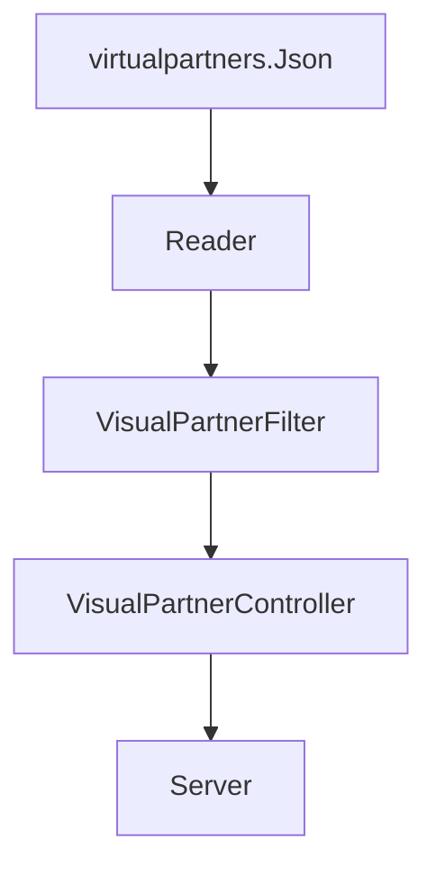
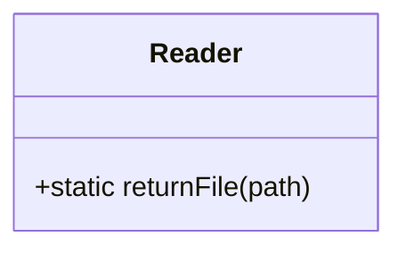
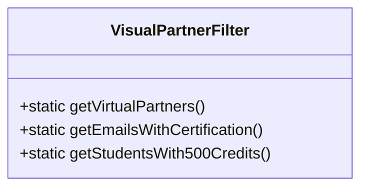
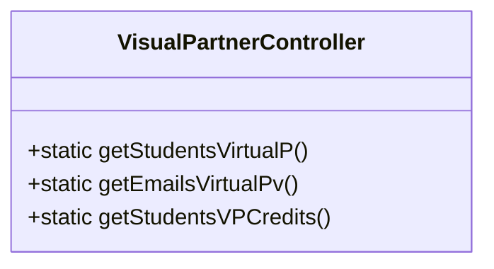

# Visual Thinking Api
Este proyecto fue hecho para poner en practica los conocimientos adquiridos respecto al uso de dependencias como Express, eslint y Jest.
Mediante este proyecto, el usuario puede consultar, mediante un servidor,  una lista de alumnos alojada en un archivo json. 
Si desea ver el servidor remoto de la API, está en esta dirección <code>https://stark-inlet-21661.herokuapp.com/</code>

## Caracteristicas de proyecto

<i><h3>Dependencias necesarias</h3></i>

<dl>
    <dt>Jest</dt>
        <dd>Llevar a cabo las pruebas unitarios necesarias de cada módulo</dd>
    <dt>Express</dt>
        <dd>Crear el servidor y comunicar entre este y el usuario</dd>
    <dt>eslint</dt>
        <dd>Corregir posibles problemas dentro del código y aplicar un formato</dd>
</dl>

<i><h3>Estrutura</h3></i>

Donde:
<dl>
<dt>Reader</dt>
<dd>Interpreta el archivo Json y almacena envía sus datos

* <b>returnFile</b>: -El módulo recibe la ubicación del archivo JSON a leer (path). -Los datos del archivo los almacena y lo envía como respuesta 
</dd>
<dt>VisualPartnerFilter</dt>
<dd>Procesa los datos interpretados por "Reader" y filtra la información de acuerdo a los requisitos solicitados</dd>

* <b>getVirtualPartners()</b>: -Se encarga de enviar la ubicación del archivo JSON al módulo Reader,y almacena la lista de datos de los estudiantes de VirtualPartners 
* <b>getEmailsWithCertification()</b>: -Con la lista obtenida por <i>getVirtualPartners()</i>, filtra a los estudiantes cuyo value para la key "haveCertification" sea el valor booleano <i>True</i>. -Ya almacenados los datos de los estudiantes filtrados, envía como respuesta un array con el "email" de cada estudiante 
* <b>getStudentsWith500Credits()</b>: -Con la lista de datos obtenida por <i>getVirtualPartners()</i>, filtra a los estudiantes cuyo value para la key "credits" sea mayor a 500, y los envia como respuesta. 
</dd>

<dt>VisualPartnerController</dt>
<dd>Recibe la solicitud de información del "Server", la cual envía al método en "VisualPartnerFilter" correspondiente.</dd>

* <b>getStudentsVirtualP()</b>: -Recibe la petición de server.js -Llama al método <i>getVirtualPartners()</i> en VisualPartnerFilter, obteniendo la lista de datos de los estudiantes  -Envía como respuesta los datos 
* <b>getEmailsVirtualPv()</b>: -Recibe la petición de server.js -Llama al método <i>getEmailsWithCertification</i> en VisualPartnerFilter, obteniendo la lista de emails de los estudiantes con "Certification" -Envía como respuesta el array 
* <b>getStudentsVPCredits()</b>: -Recibe la petición de server.js -Llama al método <i>getStudentsWith500Credits</i> en VisualPartnerFilter, obteniendo la lista de datos de estudiantes cuyos valor en "Credits" sea mayor que 500 -Envía como respuesta los datos filtrados 
</dd>

<dt>Server</dt>
<dd>Responde la solicitudes del usuario
</dd>
</dl>

## Requisitos
>Contar con NPM instalado

## Instalación
>1) Clonar el repo al ordenador <code>git clone https://github.com/ErickMontesDK/VIsual-Thinking-Api </code>
>2) Instalar el paquete y dependencias en la carpeta de proyecto  <code>npm install </code>

## Consulta
La API se encuentra accesible para cualquier persona en un servidor, pero si quiere revisar el código y tener un servidor local, lea la siguiente información:

### Consulta en servidor local

Las rutas o "endpoints" declaradas para consulta de información son las siguientes
Primero es iniciar el servidor <code>npm run server</code>

* <b>Datos de estudiantes:</b>

> Ingresar url <code>http://localhost:3000/virtualpartners/students</code> 
Devuelve la lista de datos de todos los estudiantes de VirtualPartners

* <b>Emails de estudiantes con certificado</b>

>Ingresar url <code>http://localhost:3000/virtualpartners/emails/certificate/</code> 
Devuelve la lista de emails de todos los estudiantes de VirtualPartners que tengan certificación <i>"haveCertification:true"</i>.

* <b>Estudiantes con creditos mayores a 500</b>

>Ingresar url <code>http://localhost:3000/virtualpartners/students/fullcredits</code> 
Devuelve la lista de estudiantes de VirtualPartners cuyo valor de credits sea mayor a 500

### Consulta servidor remoto
La API se encuentra en el URL: <code>https://stark-inlet-21661.herokuapp.com/</code>. Ahí mismo estan los links hacia las opciones de consulta.

