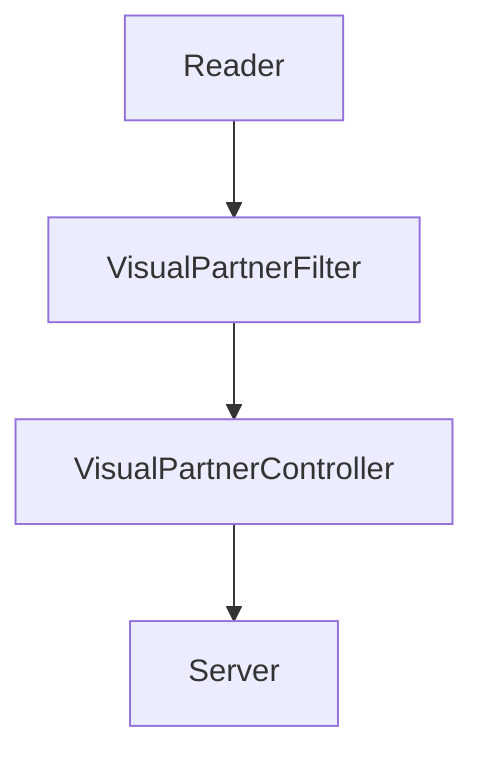

# Visual Thinking Api
Este proyecto fue hecho para poner en practica los conocimientos adquiridos respecto al uso de dependencias como Express, eslint y Jest.
Mediante este proyecto, el usuario puede consultar una lista json por un servidor. 

## Caracteristicas de proyecto

<i><h3>Dependencias necesarias</h3></i>

<dl>
    <dt>Jest</dt>
        <dd>Llevar a cabo las pruebas unitarios necesarias de cada módulo</dd>
    <dt>Express</dt>
        <dd>Crear el servidor y comunicar entre este y el usuario</dd>
    <dt>eslint</dt>
        <dd>Corregir posibles problemas dentro del código y aplicar un formato</dd>
</dl>

<i><h3>Estrutura</h3></i>

Donde:
<dl>
    <dt>Reader</dt>
        <dd>Interpreta el archivo Json y almacena envía sus datos</dd>
    <dt>VisualPartnerFilter</dt>
        <dd>Procesa los datos interpretados por "Reader" y filtra la información de acuerdo a los requisitos solicitados</dd>
    <dt>VisualPartnerController</dt>
        <dd>Recibe la solicitud de información del "Server", la cual envía al método en "VisualPartnerFilter" correspondiente.</dd>
    <dt>Server</dt>
        <dd>Responde la solicitudes del usuario
        </dd>
</dl>

## Requisitos
>Contar con NPM instalado

## Instalación
>1) Clonar el repo al ordenador <code>git clone https://github.com/ErickMontesDK/VIsual-Thinking-Api </code>
>2) Instalar el paquete y dependencias en la carpeta de proyecto  <code>npm install </code>

## Consulta
Las rutas o "endpoints" declaradas para consulta de información son las siguientes
Primero es iniciar el servidor <code>npm run server</code>

* <b>Datos de estudiantes:</b>

> Ingresar url <code>http://localhost:3000/virtualpartners/students</code> 
Devuelve la lista de datos de todos los estudiantes de VirtualPartners

* <b>Emails de estudiantes con certificado</b>

>Ingresar url <code>http://localhost:3000/virtualpartners/emails/certificate/</code> 
Devuelve la lista de emails de todos los estudiantes de VirtualPartners que tengan certificación <i>"haveCertification:true"</i>.

* <b>Estudiantes con creditos mayores a 500</b>

>Ingresar url <code>http://localhost:3000/virtualpartners/students/fullcredits</code> 
Devuelve la lista de estudiantes de VirtualPartners cuyo valor de credits sea mayor a 500

