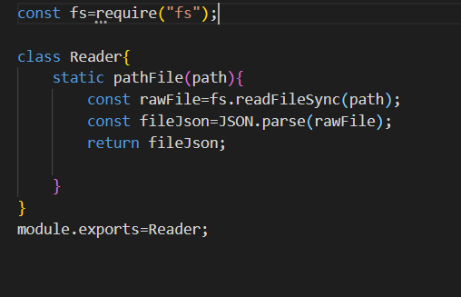
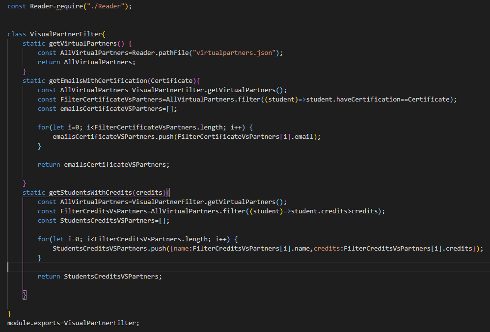

# Code-Challenge
Ejercicio 5 Semana 4-LaunchX Node JS

## Caracteristicas de proyecto

<i><h3>Dependencias necesarias</h3></i>

<dl>
    <dt>Jest</dt>
        <dd>Llevar a cabo las pruebas necesarias de cada módulo</dd>
    <dt>Express</dt>
        <dd>Crear un servidor local</dd>
    <dt>eslint</dt>
        <dd>Corregir posibles problemas dentro del código y aplicar un formato</dd>
</dl>

<i><h3>Componentes</h3></i>

1. <b><i>Reader.js</i></b>

* El módulo recibe la ubicación del archivo JSON a leer.  
* Los datos del archivo los almacena como Json (AllVirtualPartners), y lo envía como respuesta

2. <b><i>VirtualPartnerFilter.js</i></b>

* El módulo posee tres métodos static:  
a) <b>getVirtualPartners:</b> Se encarga de enviar la ubicación del archivo JSON al módulo Reader,y almacena la lista de datos de los estudiantes de VirtualPartners 
b) <b>getEmailsWithCertification:</b> Recibe un valor booleano. Con la lista obtenida por getVirtualPartners(), filtra a los estudiantes cuyo value para la key "haveCertification" sea el valor booleano recibido. Ya almacenados los datos de los estudiantes filtrados, almacena solo el value de "email" de cada estudiante, y los va almacenando en un array (emailsCertificateVSPartners), la cual manda como respuesta. 
c) <b>getStudentsWithCertification:</b> Recibe un valor numérico. Con la lista de datos obtenida por getVirtualPartners(), filtra a los estudiantes cuyo value para la key "credits" sea mayor al valor numerico recibido. Ya almacenados los datos de los estudiantes filtrados, almacena los value de "nombre" y "credits" de cada estudiante, y los va almacenando en un array (StudentsCreditsVSPartners), la cual manda como respuesta. 

3. <b><i>Server.js</i></b>
  
Crea la conexion al servidor local, recibe la petición del usuario, llama al modulo VirtualPartnerFilter para recibir y enviar la información requerida.
Esta conformado por 4 métodos get: 
a) <b>app.get("/",(req,res)=={...})</b>:al escrbir la direccion '/', el usuario recibe un mensaje de bienvenida. 
b)<b>app.get("/virtualpartners/students",(req,res)=={...})</b>:al escribir la direccion "/virtualpartners/students", se llama al método static getVirtualPartners() en VirtualPartnerFilter, el cual da de respuesta la lista de estudiantes de VirtualPartners, y la envia de respuesta al servidor 
c)<b>app.get("/virtualpartners/emails/certificate/",(req,res)=={...})</b>: al escribir la direccion "/virtualpartners/emails/certificate/", llama al método static getVirtualPartners() en VirtualPartnerFilter, enviandole el valor que se busca de true para las key "haveCertification" de cada estudiante. La respuesta, que es la lista de emails de estudiantes con Certificación, es enviada como respuesta al servidor. 
d)<b>app.get("/virtualpartners/students/fullcredits/",(req,res)=={...})</b>: al escribir la direccion "/virtualpartners/students/fullcredits/", llama al método static getStudentsWithCredits() en VirtualPartnerFilter, enviandole el valor (500) que se busca que sea menor en comparacion con el value las key "credits" de cada estudiante. La respuesta, que es la lista de nombres y créditos de estudiantes que tienen más credítos del valor enviado, es enviada como respuesta al servidor. 

*<b>app.listen(por,()=>{...}</b>: Conecta con el puerto asignado (3000) y manda mensaje a consola

## Consulta
Primero es iniciar el servidor <code>npm run server</code>

<h4>Inicio de servidor</h4>
Ingresar url <code>http://localhost:3000/</code>

<h4>Obtener datos de estudiantes</h4>
Ingresar url <code>http://localhost:3000/virtualpartners/students</code> 
Devuelve la lista de datos de todos los estudiantes de VirtualPartners

<h4>Obtener lista de emails de estudiantes con certificado</h4>
Ingresar url <code>http://localhost:3000/virtualpartners/emails/certificate/</code> 
Devuelve la lista de emails de todos los estudiantes de VirtualPartners que tengan certificación <i>haveCertification</i>.

<h4>Obtener estudiantes con creditos mayores a 500</h4>
Ingresar url <code>http://localhost:3000/virtualpartners/students/fullcredits</code> 
Devuelve la lista de nombres y créditos de todos los estudiantes de VirtualPartners que tengan credits mayor a 500

